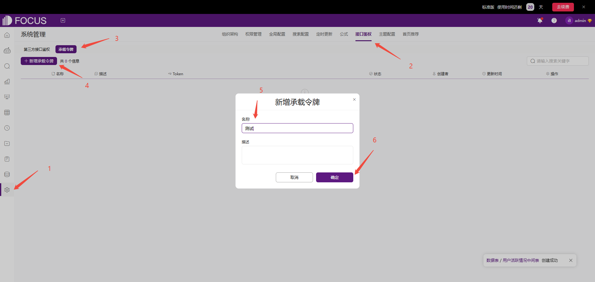
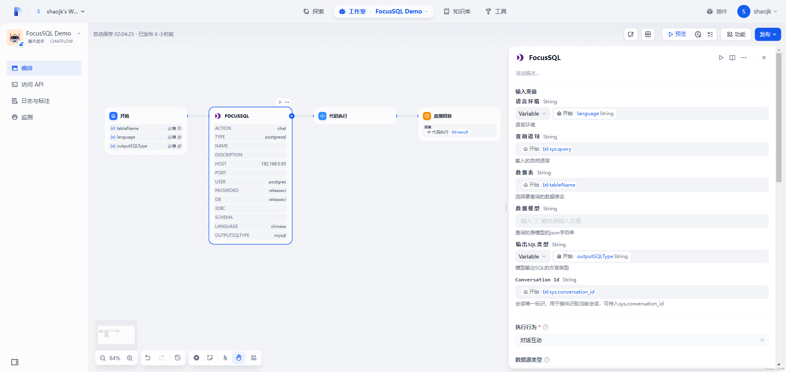
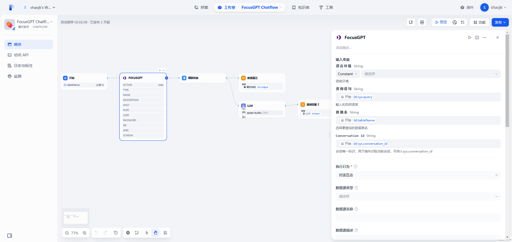

## English

### Overview

The DataFocus tool can help you to query database data or generate SQL statements with natural language. The following will introduce how to configure and an example demonstration.

### 1. Apply for DataFocus Token

If you don't have the DataFocus application yet, please apply for one on the [DataFocus Website](https://www.datafocus.ai/en).
Log in to your DataFocus application. Click **Admin** > **Interface Authentication** > **Bearer Token** > **New Bearer Token**, to create a new token and get _the token value_.

If you have a DataFocus private deployment environment, you can get Token on your own environment.

### 2. Fill in the configuration in Dify

Install DataFocus from Marketplace and fill **token** and **host** in the authorization page.
Token is the value obtained in the previous step.
If you have a DataFocus private deployment environment, host is your environment host. Otherwise, the SAAS environment address can be used by default. 

### 3. Use the tool

DataFocus includes two tools, FocusSQL and FocusGPT.

#### FocusSQL

FocusSQL is a natural language to SQL plugin based on keyword parsing.


##### Output Variable JSON

| Name     | Type   | Description              |
| -------- | ------ | ------------------------ |
| content  | string | Generated SQL statements |
| question | string | Generated keywords       |
| type     | string | Return type              |

Output Example

```json
{
  "content": "select tbl_1882337315366133767.区域 as col_10715907381350065719,sum(tbl_1882337315366133767.销售数量) as col_9787758666777884439 from string tbl_1882337315366133767 group by tbl_1882337315366133767.区域 order by tbl_1882337315366133767.区域",
  "question": "区域 销售数量的总和",
  "type": "sql"
}
```

#### 

#### FocusGPT

FocusGPT is an intelligent query plugin that supports multiple rounds of conversations, which allow you query data from your database. 
FocusGPT not only can return query SQL but also return query result to you.


##### Output Variable JSON

| Name           | Type       | Description                                    |
| -------------- | ---------- | ---------------------------------------------- |
| code           | number     | Status code                                    |
| columns        | [[object]] | 2D array storing query result data            |
| count          | number     | Number of rows returned                        |
| duration       | string     | Query execution time in seconds                |
| headers        | [object]   | Column header information for 2D array columns |
| » display      | string     | Column header display name                     |
| » name         | string     | Original column name                           |
| » suf          | string     | Column prefix indicating aggregation method    |
| sql            | [object]   | SQL corresponding to the query                 |
| »select_clause | string     | SQL corresponding to the query                 |
| title          | string     | Generated keywords from parsing                |

Output Example

```json
{
  "code": 0,
  "columns": [
    [
      "2024-12-01 00:00:00.000",
      4901
    ],
    [
      "2025-01-01 00:00:00.000",
      4408
    ],
    [
      "2025-02-01 00:00:00.000",
      4223
    ],
    [
      "2025-03-01 00:00:00.000",
      4987
    ]
  ],
  "count": 4,
  "duration": "0.334571",
  "headers": [
    {
      "display": "订单日期(MONTHLY)",
      "name": "订单日期",
      "suf": "MONTHLY"
    },
    {
      "display": "销售数量(SUM)",
      "name": "销售数量",
      "suf": "SUM"
    }
  ],
  "sql": {
    "from_clause": "",
    "group_by_clause": "",
    "having_clause": "",
    "order_by_clause": "",
    "select_clause": "select date_trunc('month', \"电商销售数据gauss\".\"订单日期\") as col_0,sum(\"电商销售数据gauss\".\"销售数量\") as col_1 from \"电商销售数据gauss\" group by date_trunc('month', \"电商销售数据gauss\".\"订单日期\") order by date_trunc('month', \"电商销售数据gauss\".\"订单日期\")",
    "where_clause": ""
  },
  "title": "每月 销售数量"
}
```

#### 

#### Configuration

FocusSQL and FocusGPT have similar configuration. Below are the functions and usage instructions of each parameter

| Parameter       | Description                                                  |
| --------------- | ------------------------------------------------------------ |
| Language        | Language environment, only support *Chinese* and *English*   |
| Query Statement | Natural language input by users                              |
| Table Name      | Target data table for query                                  |
| Data Model      | Custom model parameter entry                                 |
| Output SQL Type | Output SQL Type                                              |
| Conversation Id | Unique identifier of the session, which allow tool identify and maintain session state |
| Action          | The behavior of tool execution currently includes two types: obtaining table lists and dialogues |
| Datasource Type | Types of external data sources connected. If datasource type was selected, the connection parameters below need to be filled in |
| Host            | host                                                         |
| Port            | port                                                         |
| DB user         | user                                                         |
| DB Password     | password                                                     |
| Database Name   | database name                                                |
| JDBC            | JDBC                                                         |
| Schema          | Schema name                                                  |

#### Model Parameters

The data model needs to pass in a JSON string, and the structure of the model is as follows

##### Structure

| Name                 | Type     | Required | Description                    |
| -------------------- | -------- | -------- | ------------------------------ |
| type                 | string   | true       | Database type                  |
| version              | string   | true       | Database version, eg: 8.0      |
| tables               | [object] | true       | Table structure list           |
| » tableDisplayName   | string   | false       | Table display name             |
| » tableName          | string   | false       | Original table name            |
| » columns            | [object] | false       | Columns structure list         |
| »» columnDisplayName | string   | true       | Column display name            |
| »» columnName        | string   | true       | Original column name           |
| »» dataType          | string   | true       | Column data type               |
| »» aggregation       | string   | true       | Column default aggregation     |
| relations            | [object] | true       | Association relationship list  |
| » conditions         | [object] | false       | Associated conditions          |
| »» dstColName        | string   | false       | Dimension original column name |
| »» srcColName        | string   | false       | Fact original column name      |
| » dimensionTable     | string   | false       | Dimension original table name  |
| » factTable          | string   | false       | Fact original table name       |
| » joinType           | string   | false       | Association type               |

##### Parameter values

###### type

| DataBase   | Value      |
| ---------- | ---------- |
| MySQL      | mysql      |
| ClickHouse | clickhouse |
| Impala     | impala     |

###### dataType 

| DataType     | Value     |
| ------------ | --------- |
| Boolean      | boolean   |
| Integer      | int       |
| Long integer | bigint    |
| Float        | double    |
| String       | string    |
| Timestamp    | timestamp |
| Date type    | date      |
| Time type    | time      |

###### aggregation

| Aggregation            | Value          |
| ---------------------- | -------------- |
| Sum                    | SUM            |
| Mean                   | AVERAGE        |
| Min                    | MIN            |
| Max                    | MAX            |
| Count                  | COUNT          |
| Number of deduplicates | COUNT_DISTINCT |
| Variance               | VARIANCE       |
| Standard deviation     | STD_DEVIATION  |
| None                   | NONE           |

###### joinType

| Assocation        | Value      |
| ----------------- | ---------- |
| Left association  | LEFT JOIN  |
| Right association | RIGHT JOIN |
| Internal          | INNER JOIN |
| Fully associative | FULL JOIN  |

##### Example

model

```json
{
  "type": "mysql",
  "version": "8.0",
  "tables": [
    {
      "tableDisplayName": "string",
      "tableName": "string",
      "columns": [
        {
          "columnDisplayName": null,
          "columnName": null,
          "dataType": null,
          "aggregation": null
        }
      ]
    }
  ],
  "relations": [
    {
      "conditions": [
        {
          "dstColName": null,
          "srcColName": null
        }
      ],
      "dimensionTable": "string",
      "factTable": "string",
      "joinType": "LEFT JOIN"
    }
  ]
}
```


### Consult

[](https://discord.gg/TUahEW2C)

[DataFocus Discord](https://discord.gg/TUahEW2C)

