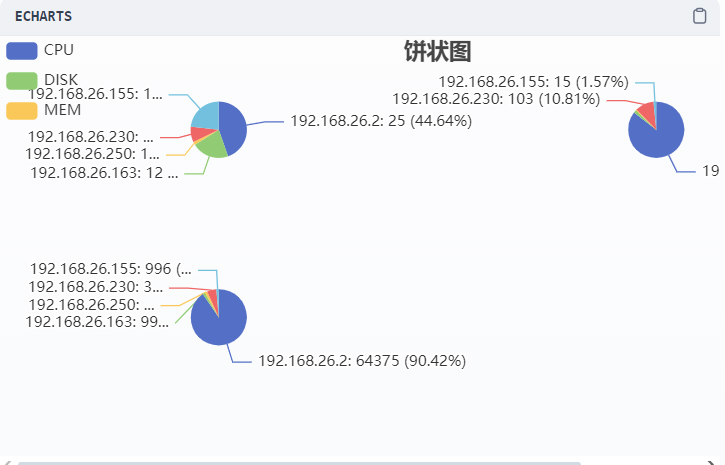
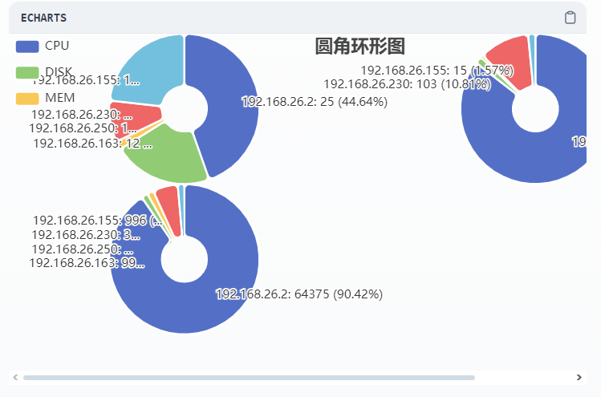
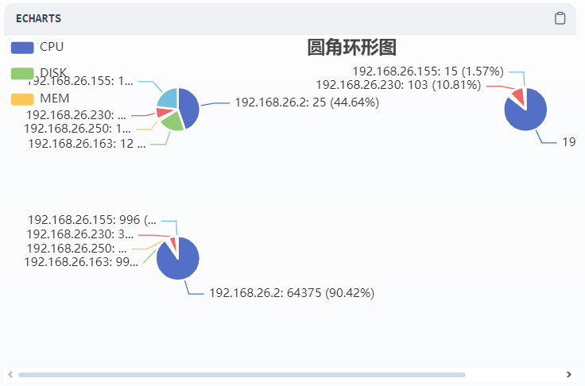
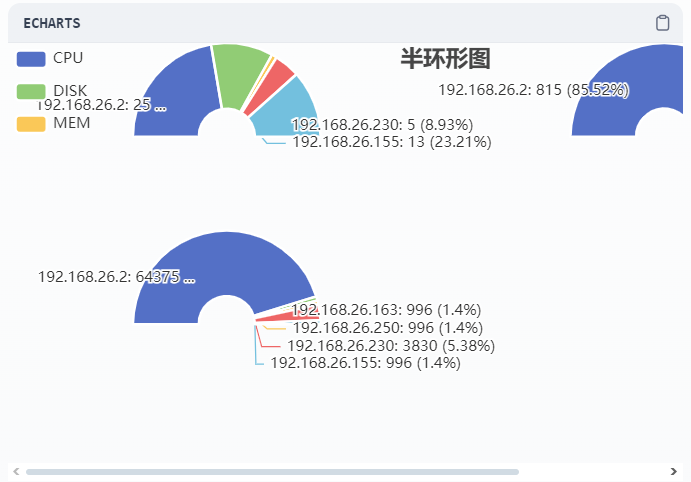
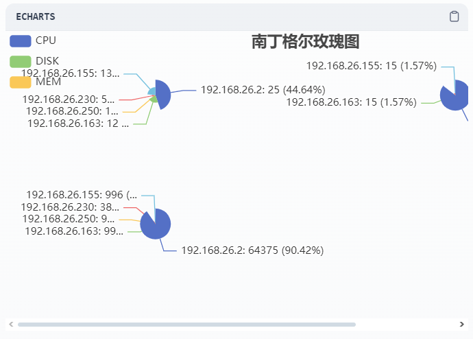
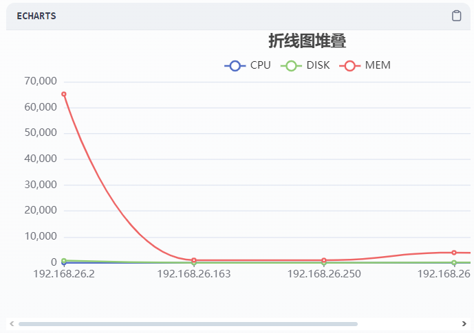
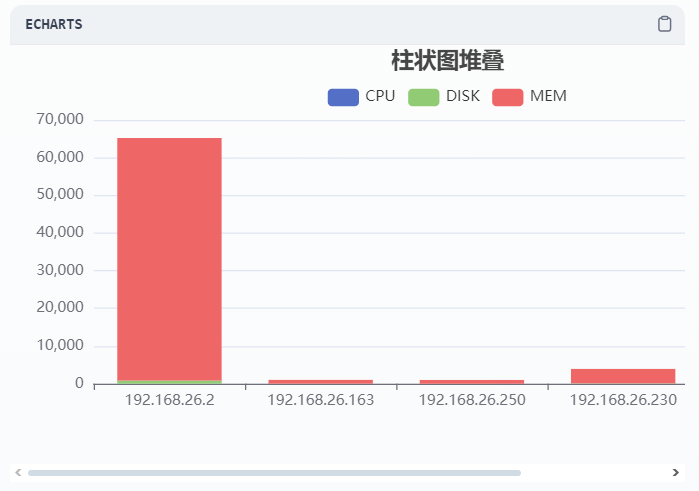
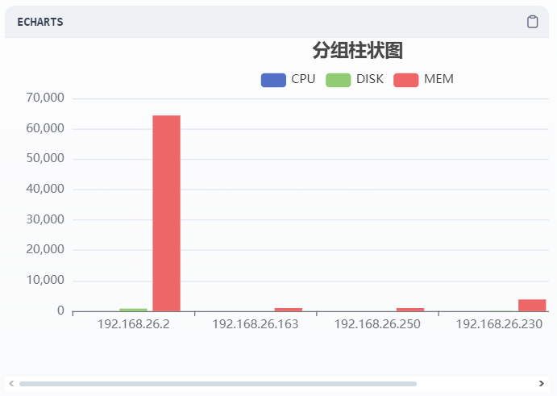
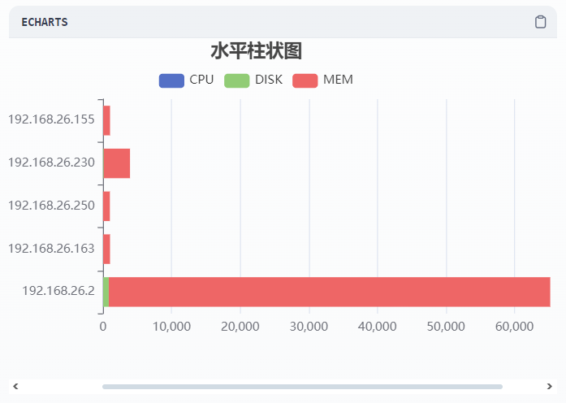
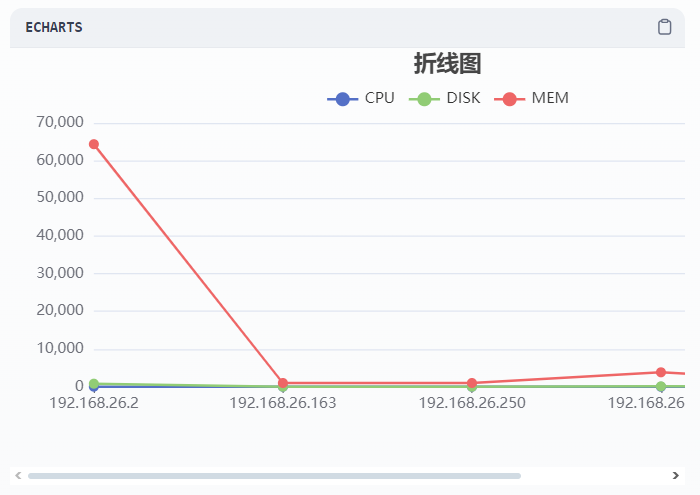

## dify_echarts

**Author:** fly
**Version:** 0.0.1
**Type:** tool

### Description
    This plugin can convert statistical data into ECharts charts for display.
    Choose the chart type format. It can be one of `pie (饼图)`, `rounded_donut (圆角环形图)`, `gap_pie (饼图-扇区间隙)`, `semi_donut (半环形图)`, `rose (南丁格尔玫瑰图)`, `stacked_line (折线图堆叠)`, `bar (柱状图堆叠)`, `grouped_bar (分组柱状图)`, `horizontal_bar (水平柱状图)`, `line (折线图)`, `scatter (散点图)`.

### Features
- Consistent with Apache ECharts experience.
- Supports multiple chart types.
- Simple to use, with a good-looking interface.

### Usage
#### Echarts Data format
- Data type string
- Required
```csv
INNERIP,CPU,DISK,MEM
192.168.26.2,25,815,64375
192.168.26.163,12,15,996
192.168.26.250,1,5,996
192.168.26.230,5,103,3830
192.168.26.155,13,15,996
```
#### Chart type format
- Data type string
- Required
- Supports both variables and constants
#### Chart title format
- Data type string
- Required
  
### Example
- pie
  
  

- rounded_donut
  
  

- gap_pie
  
  

- semi_donut
  
  

- rose
  
  

- stacked_line
  
  

- bar
  
  

- grouped_bar
  
  

- horizontal_bar
  
  

- line
  
  

- scatter
  
  