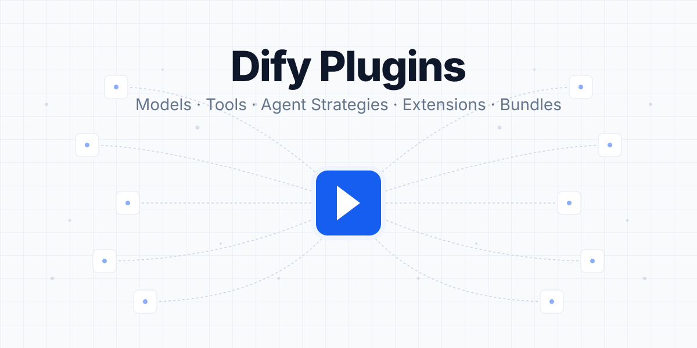
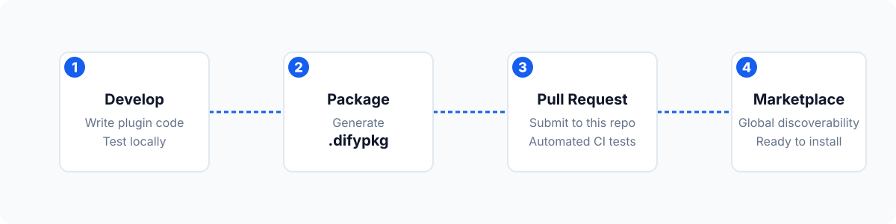

**An open-source ecosystem of models, tools, and extensions that supercharge your [Dify](https://dify.ai) applications.**

[Dify Marketplace](https://marketplace.dify.ai/) · [Documentation](https://docs.dify.ai) · [Plugin Development](https://docs.dify.ai/en/develop-plugin/getting-started/getting-started-dify-plugin)

---

## 🧩 What are Dify Plugins?

[Dify](https://dify.ai/) is an open-source platform for developing LLM-powered AI applications. **Dify Plugins** (hosted in this repository and showcased on the [Dify Marketplace](https://marketplace.dify.ai/)) are community and official extensions that seamlessly integrate into your AI workflows. 

> **Note on Repository Structure:** 
> You might notice hundreds of directories at the root of this repository (e.g., `google`, `aws`, `langgenius`). These are **Organization Folders** where developers store their plugin packages. Do not alter their structure, as the automated marketplace indexer relies on them.

## 📦 Plugin Categories

| Category | Description |
| :--- | :--- |
| **🧠 Models** | Integrate LLM providers, vision models, and custom self-hosted inferences. |
| **🛠️ Tools** | Third-party API services (search, web scraping, internal databases) callable by Agents. |
| **🤖 Agent Strategies** | Custom reasoning loops (ReAct, Plan-and-Solve) determining how LLMs select tools. |
| **🔌 Extensions** | Lightweight endpoints for fast custom integrations via HTTP services. |
| **🗂️ Bundles** | Curated collections of multiple plugins installed as a single unit. |

---

## 🚀 Publishing to the Marketplace

Share your custom plugins with the global Dify community. All merged PRs containing valid plugins are automatically synchronized to the official Marketplace.

  

### Quick Start
1. **Develop**: Follow the [Plugin Development Guidelines](https://docs.dify.ai/en/develop-plugin/publishing/standards/contributor-covenant-code-of-conduct) and write your `README.md` and Privacy Policy.
2. **Package**: Build your plugin into a `.difypkg` distribution file.
3. **Fork & Organize**: Fork this repository. Create a directory named after your organization (e.g., `your-github-name/my-awesome-plugin/`), and place your source code and `.difypkg` file inside.
4. **Pull Request**: Open a PR. Ensure your PR changes **only one** `.difypkg` file. Our CI will automatically validate your package.
5. **Merge**: Once approved, your plugin goes live on the [Dify Marketplace](https://marketplace.dify.ai/).

*Tip: Want automated updates? Check out the [Plugin Auto-PR guide](https://docs.dify.ai/en/develop-plugin/publishing/marketplace-listing/plugin-auto-publish-pr) to set up CI/CD workflows for your plugins.*

## 🛡️ Security

To protect your privacy and ensure safe resolution, please do **not** post security vulnerabilities on public GitHub issues. Email [security@dify.ai](mailto:security@dify.ai) instead.
