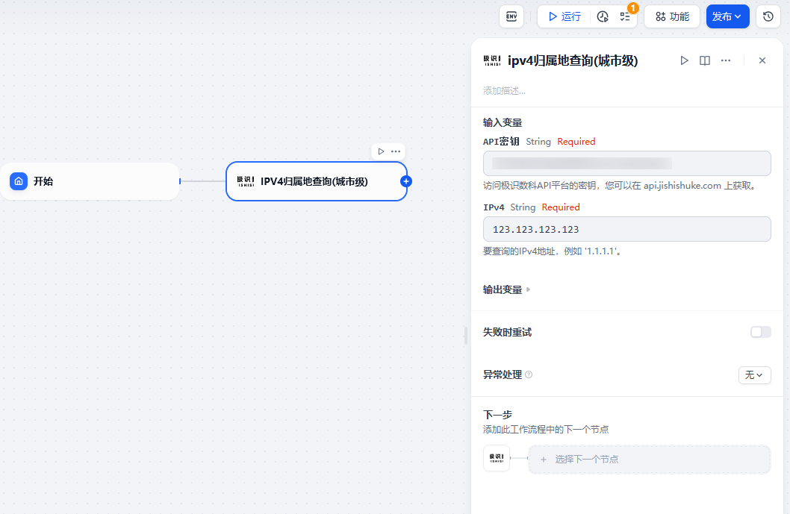
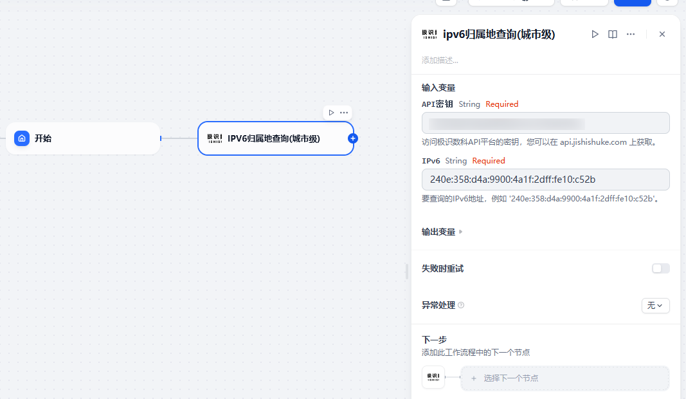

## Jishishuke Api Toolbox

**Author:** [guhx](https://github.com/billy723/dify-plugin-jishishuke)
**Version:** 0.0.1
**Type:** Tool


### 关于我们
郑州极识数字科技有限公司是一家集地理空间、网络空间和实体空间于一体的地址类数据服务商。针对于Dify平台，我们提供了一些工具插件来调用我们API服务，进而为您的AI工作流提供更多功能。

---

### 功能特性
* **Ipv4 Location Query - City** — Ipv4地址归属地查询，城市级精度。[字段说明](https://api.jishishuke.com/doc/44)
* **Ipv6 Location Query - City** — Ipv6地址归属地查询，城市级精度。[字段说明](https://api.jishishuke.com/doc/45)

---

### 🛠️使用说明
1. 在 [极识数科API接口商城](https://api.jishishuke.com/) 完成注册
2. 注册后登录，在用户控制台-密钥管理，生成并拷贝您的 API 密钥
3. 在 Dify 平台的插件管理中，添加插件，并填入密钥key与查询参数；
4. 执行查询，继续您的下一步流程。

---

### 使用示例
#### 📍 Ipv4 Location Query - City

```json
{
    "code": 200,
    "data": {
    "asNumber": "4808",
    "cityCode": "110000",
    "cityName": "北京市",
    "continentCode": "AS",
    "continentName": "亚洲",
    "countryCode": "CN",
    "countryName": "中国",
    "ipAddress": "123.123.123.123",
    "isp": "中国联通",
    "latitude": "39.903313",
    "longitude": "116.71881",
    "provinceCode": "110000",
    "provinceName": "北京市",
    "timeZone": "UTC+08:00",
    "zipcode": "100000"
    },
    "exec_time": 0.084021,
    "ip": "你的访问ip",
    "msg": "操作成功"
}
```

#### 📍 Ipv6 Location Query - City


```json
{
    "code": 200,
    "data": {
    "asNumber": "4134",
    "cityCode": "610100",
    "cityName": "西安市",
    "continentCode": "AS",
    "continentName": "亚洲",
    "countryCode": "CN",
    "countryName": "中国",
    "ipAddress": "240e:358:d4a:9900:4a1f:2dff:fe10:c52b",
    "isp": "中国电信",
    "latitude": "34.106632",
    "longitude": "108.791722",
    "provinceCode": "610000",
    "provinceName": "陕西省",
    "timeZone": "UTC+08:00",
    "zipcode": "710000"
    },
    "exec_time": 0.085515,
    "ip": "你的访问ip",
    "msg": "操作成功"
}
```

**联系方式：**

如有关于本插件的疑问，请联系作者，创建issue：[guhx](https://github.com/billy723/dify-plugin-jishishuke/issues)。关于 jishishuke 本身的相关问题，请参考 https://api.jishishuke.com