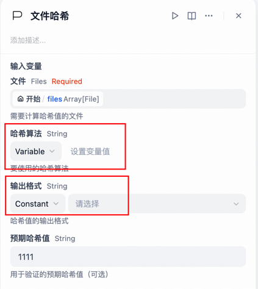

# File Operation Toolkit

**Author:** hanw39
**Version:** 0.0.1
**Type:** plugin

## Project Overview

This is a modular file operation toolkit providing various file processing functions. The project adopts an extensible architecture design, allowing for easy addition of new file operation tools. Currently, file hash calculation functionality is implemented, with more file operation tools to be added in the future.

## Architecture Design

The project adopts a layered architecture:

- **Provider Layer**: Serves as the unified entry point for all file operation tools, handling authentication and common functionalities
- **Tool Layer**: Implements specific file operation functions, with each tool maintained and developed independently

## Current Tools

### File Hash Tool

Calculates file hash digests, supporting multiple algorithms and formats.

#### Features

- **Multiple Hash Algorithm Support**
  - Traditional algorithms: MD2, MD5, SHA-1
  - Modern standard algorithms: SHA-256, SHA-384, SHA-512
  - Advanced modern algorithms: SHA3-256, BLAKE2b
- **Multiple Output Formats**
  - Hexadecimal (default)
  - Base64 encoding
  - Binary representation
- **Advanced Features**
  - Support for downloading files from URLs and calculating hashes
  - Support for batch processing of multiple files
  - Large file chunk processing with progress reporting
  - Hash value verification (by comparing with expected hash values)
  - Algorithm security rating
  - Detailed performance statistics
- **User-Friendly**
  - Intuitive interface design
  - Detailed result output
  - Intelligent error handling

#### Usage




#### Return Results
The tool returns a JSON object containing the following information:
- Success/failure status
- Basic file information (name, size, etc.)
- Selected algorithm and its security rating
- Generated hash value (in specified format)
- Processing time (milliseconds)
- Verification results (if expected hash value is provided)
```json
  {
  "text": "",
  "files": [],
  "json": [
    {
      "code": 0,
      "message": "Downloading file pre-sales-proposal-review-form-241216.xlsx...",
      "progress": 0,
      "status": "processing"
    },
    {
      "code": 0,
      "data": {
        "file": {
          "name": "pre-sales-proposal-review-form-241216.xlsx",
          "size": {
            "bytes": 3469575,
            "readable": "3.31 MB"
          }
        },
        "hash": {
          "algorithm": "MD5",
          "format": "base64",
          "security": {
            "description": "Broken, only for integrity checks",
            "rating": "Insecure"
          },
          "value": "mvWXxH2wZMeeLPZ28EZHFA=="
        },
        "processing_time_ms": 10.19,
        "status": "success",
        "verification": {
          "actual": "mvWXxH2wZMeeLPZ28EZHFA==",
          "expected": "111",
          "status": "Not matching",
          "verified": false
        }
      },
      "message": "Hash calculation completed, verification result: Not matching"
    }
  ]
}
```

#### Batch Processing

Supports processing multiple files simultaneously, returning aggregated results:
- Total number of files
- Number of successful/failed operations
- Detailed results for each file

## Planned Tools

The project will gradually add more file operation tools, including but not limited to:

- File format conversion
- Image processing
- Document content extraction
- File compression/decompression
- File metadata extraction

## Technical Implementation

- Uses chunk processing algorithms for large files to avoid memory overflow
- Uses Python standard library hashlib to implement most hash algorithms
- Uses pycryptodome library to implement MD2 algorithm
- Uses requests library for URL downloads
- Provides real-time progress reporting
- Detailed error handling and diagnostic information

## Development and Extension

To add new file operation tools:

1. Create new tool implementation and definition files in the `tools/` directory
2. Add references to new tools in `provider/file_operation.yaml`
3. Implement specific tool logic, maintaining consistency with the existing architecture 