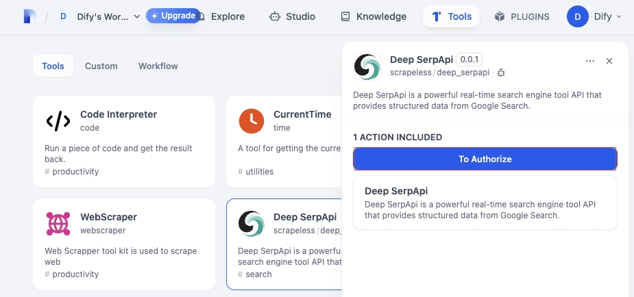
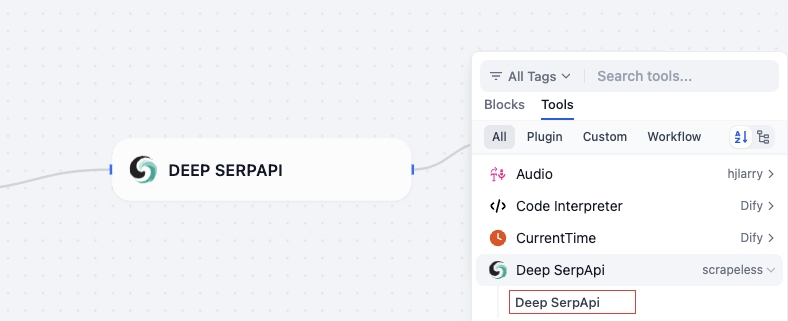

## Deep SerpApi

### Overview

Scrapeless(Deep SerpApi) is a powerful real-time search engine tool API that provides structured data from Google Search, with a low cost of $0.1 to $0.3 per 1,000 queries.

### Configuration

#### 1. Apply for an API Key

- Register scrapeless.com and provide corporate KYC certification to receive a free trial quota, and apply for an API Key
- After building your first AI tool, please contact official customer service to receive free developer support program

#### 2. Install Deep SerpApi

Install Deep SerpApi from Dify Marketplace.

#### 3. Add Deep SerpApi to your workflow

Add Deep SerpApi to your workflow. Click "To authorize" and paste the API key.

4. Using Deep SerpApi

