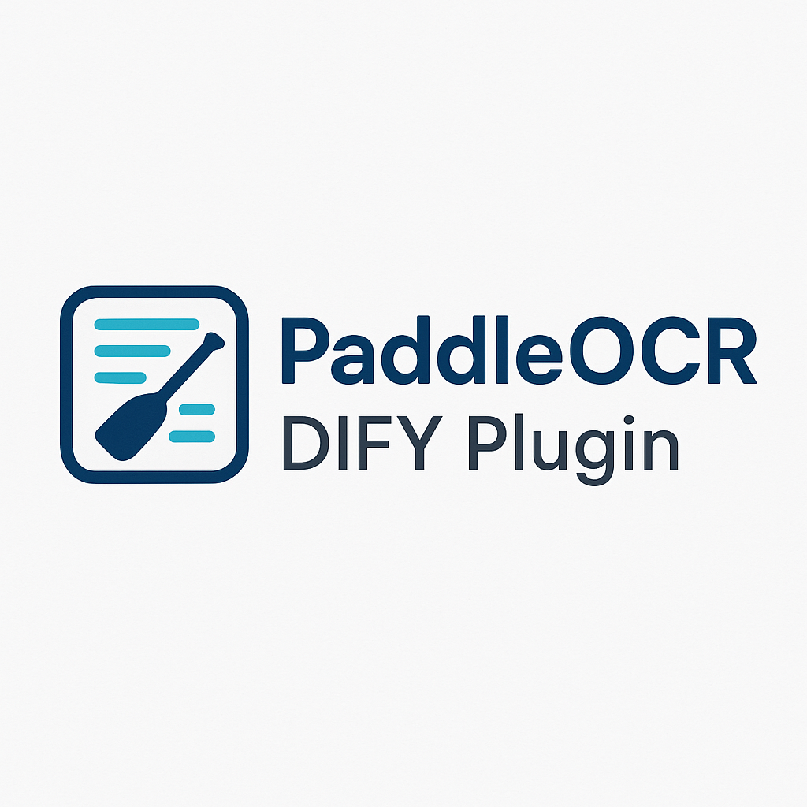

# PaddleOCR 插件

<div align="center">



**Paddle OCR Dify插件**

[](https://github.com/your-repo/paddle-ocr)
[](LICENSE)
[](https://dify.ai)

[功能特性](#功能特性) • [配置说明](#配置说明) • [示例](#示例) • [支持](#支持)

</div>

## 🚀 功能特性

PaddleOCR 插件为 Dify 应用提供光学字符识别(OCR)能力。

### 核心功能
- 📝 **多语言文字识别** - 基于百度 PaddleOCR 引擎，支持中英文及多语言识别
- 🔄 **文档方向校正** - 自动检测并校正文档方向，提高识别准确率
- 📐 **文档去卷曲** - 处理弯曲或扭曲的文档图像
- 🎯 **文本行方向识别** - 精确识别文本行的方向
- ⚙️ **灵活配置** - 支持自定义模型参数和处理选项

### 默认模型模块选项
- **文本检测模型** - PP-OCRv5_mobile_det
- **文本识别模型** - PP-OCRv5_mobile_rec
- **文档方向分类** - PP-LCNet_x1_0_doc_ori
- **文档去卷曲** - UVDoc
- **文本行方向分类** - PP-LCNet_x1_0_textline_ori


## ⚙️ 配置说明

### 基础配置

| 参数名称 | 类型 | 必填 | 默认值 | 说明 |
|---------|------|------|---------|------|
| img | 文件 | ✅ | - | 需要识别的图片文件 |
| lang | 字符串 | ❌ | ch | 识别语言 |

### 高级配置

| 参数名称 | 类型 | 必填 | 默认值 | 说明 |
|---------|------|------|---------|------|
| text_detection_model_name | 字符串 | ❌ | PP-OCRv5_mobile_det | 文本检测模型名称 |
| text_recognition_model_name | 字符串 | ❌ | PP-OCRv5_mobile_rec | 文本识别模型名称 |
| doc_orientation_classify_model_name | 字符串 | ❌ | PP-LCNet_x1_0_doc_ori | 文档方向分类模型名称 |
| doc_unwarping_model_name | 字符串 | ❌ | UVDoc | 文档去卷曲模型名称 |
| textline_orientation_model_name | 字符串 | ❌ | PP-LCNet_x1_0_textline_ori | 文本行方向分类模型名称 |
| use_doc_orientation_classify | 布尔值 | ❌ | False | 是否启用文档方向分类 |
| use_doc_unwarping | 布尔值 | ❌ | False | 是否启用文档去卷曲 |
| use_textline_orientation | 布尔值 | ❌ | False | 是否启用文本行方向分类 |


## 👋使用方法
下载仓库中paddle-ocr.difypkg文件，点击安装插件，选择本地导入

## 📄返回数据格式
   ```json
   {
     "rec_texts": [
       "识别到的文字内容1",
       "识别到的文字内容2"
     ],
     "rec_boxes": [
       [[x1, y1], [x2, y2], [x3, y3], [x4, y4]],
       [[x1, y1], [x2, y2], [x3, y3], [x4, y4]]
     ]
   }
   ```


## 🤝 支持与反馈

### 技术支持
- **开发者**: woody
- **版本**: 0.0.1
- **更新时间**: 2025-06-18

### 问题反馈
如遇到使用问题或有功能建议，请通过以下方式联系：
- 📧 提交 Issue 到项目仓库
- 🐛 报告 Bug 和功能请求
- 💡 分享使用经验和建议

### 许可协议
本插件基于 Apache 2.0 许可协议开源，详情请参阅 [LICENSE](LICENSE)。

### 版权声明
本项目基于 [PaddleOCR](https://github.com/PaddlePaddle/PaddleOCR) 开发，PaddleOCR 项目版权归 PaddlePaddle Authors 所有。

原项目许可协议：Apache License 2.0

---


